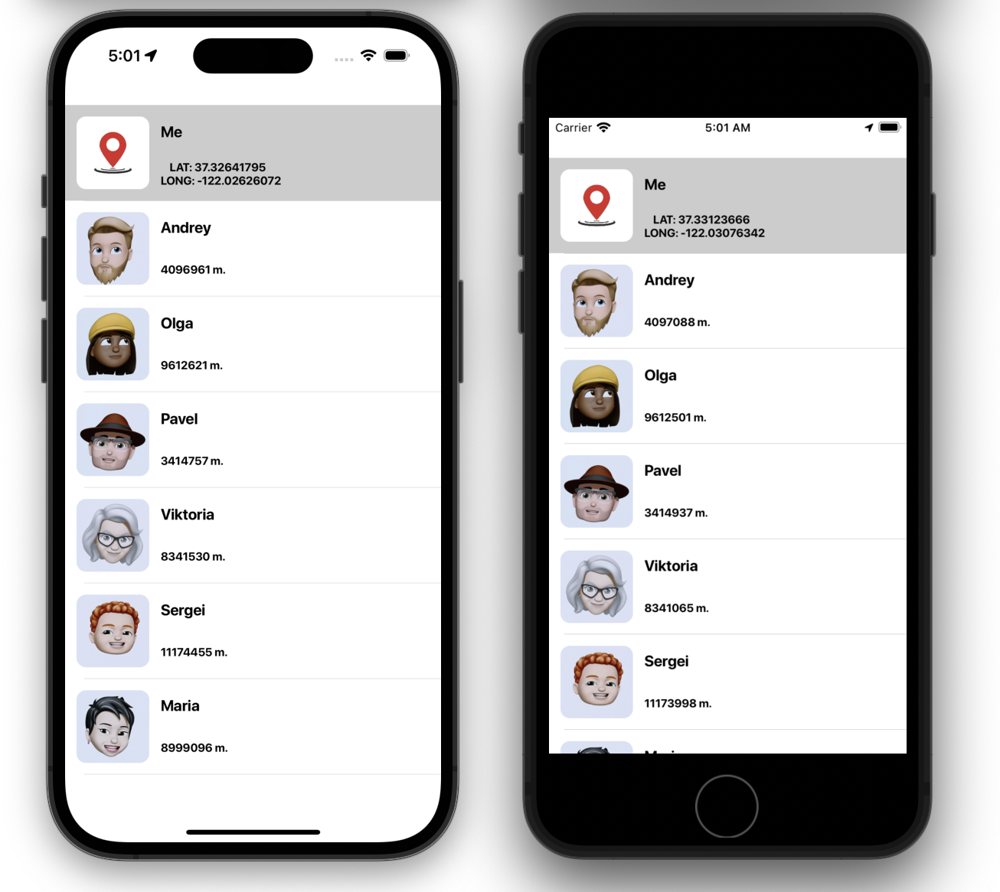

# Locator

## Оглавление
- **[Краткое описание](#Basic)**
- **[Презентация](#Presentation)**
- **[Задание](#Task)**
- **[Будет добавлено](#ComingSoon)**
 
## Краткое описание
- Проект написан на **UIKit**
- Использована архитектура **MVVM + Data Driven**
- Адаптивная верстка интерфейса **кодом**. Проверена на **iPhone 14 Pro, iPhoneSE (3st generation)**

## Презентация

## Задание
- Необходимо разработать приложение, отображающее список людей и расстояние от них до пользователя.

- **Экран поиска:**
- ☑️ Каждый элемент списка должен содержать аватар, имя и расстояние до пользователя;
- ☑️ Положение пользователя должно быть получено от GPS;
- ☑️ При нажатии на человека, информация о нём закрепляется над списком и не пропадает при скролле;
- ☑️ При повторном нажатии выбор человека от меняется;
- ☑️ Пока есть выбранный человек, расстояния остальных людей отображаются относительно выбранного;
- ☑️ Все данные о людях и их координаты должны быть получены из сервиса. Сервис - это сущность, имитирующая работу с сервисом, то есть заглушка для сетевого слоя. Каждые три секунды положение людей должно меняться со случайным смещением. Других требований к сервису, списку его “запросов” и формату данных, нет.

## Будет добавлено
- Unit testing
